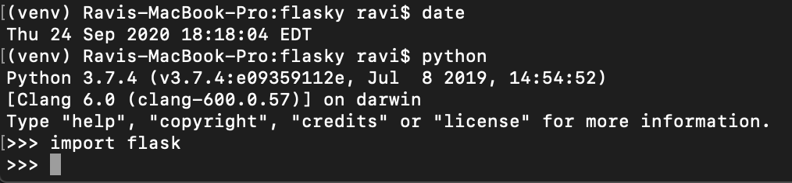
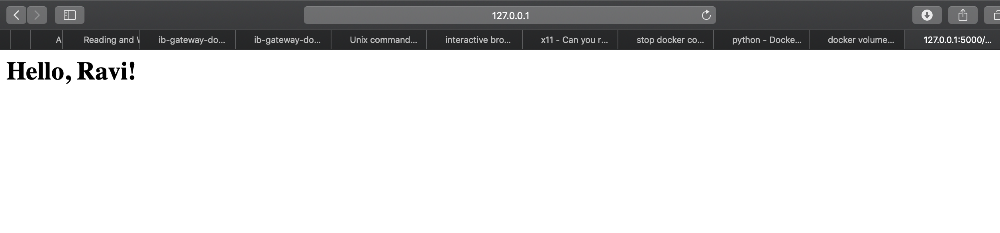

# ECE444-F2020-Lab2
Lab 2 for ECE444 uoft fall 2020

Ravi Singh
This repo is a clone of: https://github.com/miguelgrinberg/flasky

Activity 1:

Activity 2:

Activity 3:
Flask context globals are variables that are globally accessible on a thread basis i.e. they are thread-locals. This is important as for applications such as web servers that are often multi-threaded, we wouldn't want an object such as a request to be global, but rather accessible only from the thread that is processing that request.

There are two types of contexts in Flask application and request, summarized below:
- current_app (application context) : app instance for active app
- g (application context) : obj app can use for temp storage during request handling, reset per request
- request (request context) : stores contents of HTTP req
- session (request context) : user session, stores values "remembered" between requests similar to cookies
